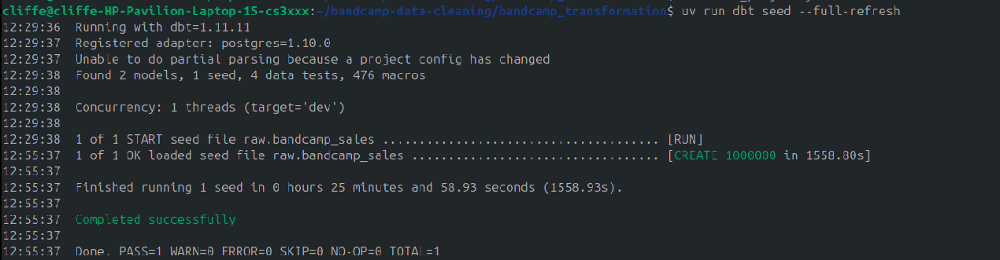
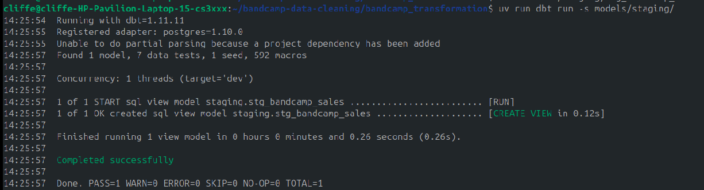
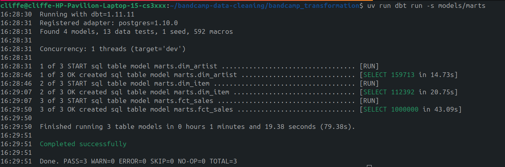
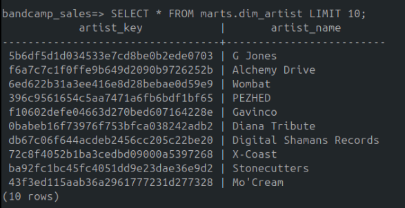
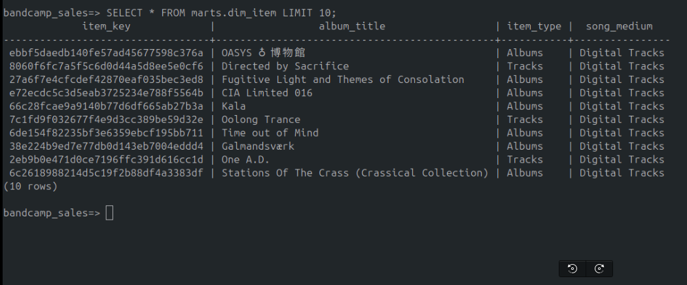
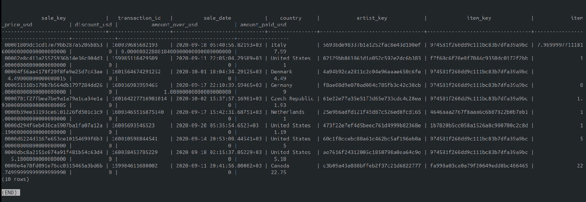
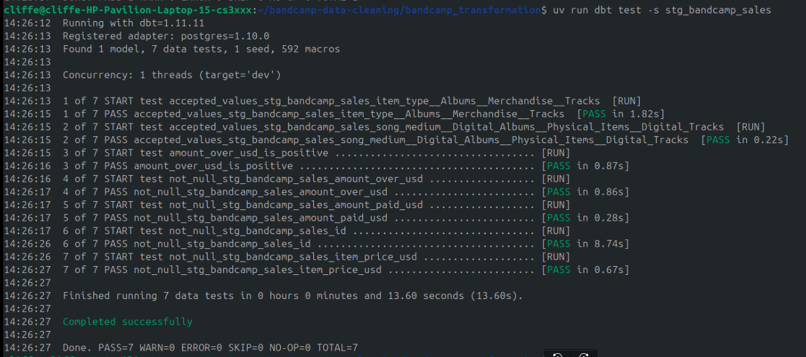
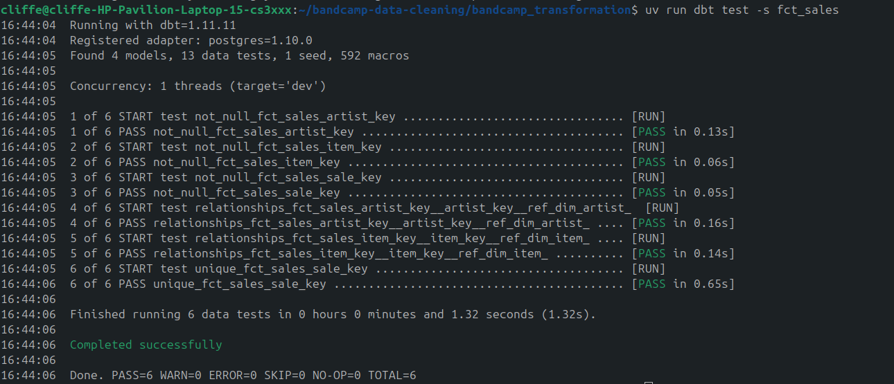

# Bandcamp Sales ELT Pipeline

This project is an end-to-end ELT data pipeline built to process and analyze raw Bandcamp sales data using **dbt core** for transformations and **postgres** for storage

The pipeline implements a strict Medallion Architecture, taking raw, messy Kaggle CSVs and transforming them into a production-ready Kimball Star Schema for downstream analytics.

## Tech Stack

**Transformation:** dbt (Core)

**Data Warehouse:** PostgreSQL

**Package Handling:** Python uv

**Package Management:** dbt_utils

## Architecture: The Medallion Approach

**Bronze:** Raw CSV data is ingested directly into a dedicated `raw` Postgres schema via dbt seeds with minimal type casting to avoid breaking the pipeline.

**Silver:** A staging view (`stg_bandcamp_sales`) that handles data type casting, standardizing categories, handling nulls and resolving currency inconsistencies.

**Gold:** Highly structured, materialized tables in the `mart` schema.

 * **Dimensions:** `dim_artist`, `dim_item` (Deduplicated entities with surrogate keys).

 * **Facts:** `fct_sales` (Financial measures linked via hashes).

## Core Challenges & Engineering Solutions
Building this pipeline required solving several critical data anomalies and structural traps native to e-commerce datasets.

### 1. 'Integer out of range' Error during ingestion
**The Problem:** Attempting to enforce database constraints (like `BIGINT` for UNIX timestamps or massive IDs) during the Load phase caused pipeline crashes due to decimal anomalies (eg 1599688803.5175).

**The Solution:** Problematic columns (`_id`, `utc_date`, `art_id`, `package_image_id`) were mapped to `varchar` in `dbt_project.yml` to guarantee successful ingestion. 

### 2. The Multi-Item Cart Anomaly (Surrogate Keys)
**The Problem:** The source system's id was assumed to be a unique primary key. However, uniqueness testing revealed duplicate IDs. The source _id represented a Transaction ID (`sale url` + `utc timestamp`), not a Line-Item ID, meaning fans buying multiple items simultaneously broke the grain of the table.

**The Solution:** Engineered a true deterministic surrogate key (`sale_key`) at the line-item grain using `dbt_utils.generate_surrogate_key` by hashing a composite of the id, Artist Name, and Album Title.

### 3. The Discount Logic
**The Problem:** Bandcamp allows promotional discount codes. If an album cost $10 but a fan paid $5, the basic tip math (`amount_paid` - `item_price`) resulted in a tip of -$5.00, ruining financial aggregates.

**The Solution:** Implemented a logical floor using Postgres's GREATEST(0, ...) function to cap tips at $0.00. Additionally, split the logic to capture explicit discounts in a dedicated `discount_usd` column to ensure gross vs. net revenue could be accurately modeled in the Gold layer.


## Testing

This project relies on automated dbt data tests to guarantee pipeline integrity before data reaches the BI layer:

 * **Unique & Not Null Tests:** Enforced on the `sale_key` surrogate key.

 * **Accepted Values:** Categorical standardization for `song_medium` and `item_type`.

 * **Singular Custom Tests:** SQL-based assertions to verify mathematical logic (eg `amount_over_usd` >= 0 at all times).

 * **Relationship Tests:** Guaranteeing perfect joins between the Fact and Dimension tables.

## How to Run the Pipeline

1. Clone the repository.
```Bash
git clone <repository url>
```

2. Install dependencies using uv:
```Bash
uv sync
uv run dbt deps
```

3. Build the architecture end-to-end:

```Bash
uv run dbt build
```

The `build` command automatically seeds the raw data:



Runs the staging models:



Runs the gold models:



 * Sample `dim_artists`:


 * Sample `dim_items`:


 * Sample `fct_sales`:


Executes all data tests in topological order
* staging


* gold

